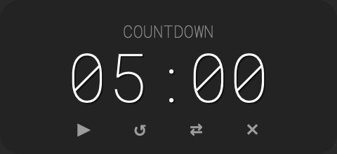

# FloatTimer

A minimal, always-on-top countdown and stopwatch widget for macOS.



## Features

- **Countdown & Stopwatch** modes — switch with the ⇄ button
- **Floating window** — stays above all apps, draggable anywhere
- **Minimal UI** — controls appear on hover, disappear when idle
- **Custom time entry** — double-click the time to type a duration
- **Chime alert** — synthesized tone plays when countdown hits zero
- **Keyboard shortcuts** — Space to play/pause, Enter to confirm edits
- **No dependencies** — single Swift file, no packages, no frameworks beyond Cocoa

## Download

[**Download FloatTimer.zip**](https://github.com/AndreBalmet/FloatTimer/releases/latest) — unzip and drag to Applications.

> On first launch, right-click → Open to bypass Gatekeeper (the app is ad-hoc signed, not notarized).

Requires macOS 13+.

## Build from Source

If you prefer to build it yourself (requires Xcode Command Line Tools):

```bash
./build.sh
open build/FloatTimer.app
```

## Usage

| Action | How |
|--------|-----|
| Play / Pause | Click ▶ or press Space |
| Reset | Click ↺ |
| Switch mode | Click ⇄ |
| Set custom time | Double-click the time display, type digits |
| Move window | Click and drag anywhere on the widget |
| Resize | Right-click and drag up/down to scale |
| Close | Click ✕ |

Time entry accepts digits as `MMSS` or `HHMMSS` (e.g. type `130` for 1 minute 30 seconds).

## License

MIT
